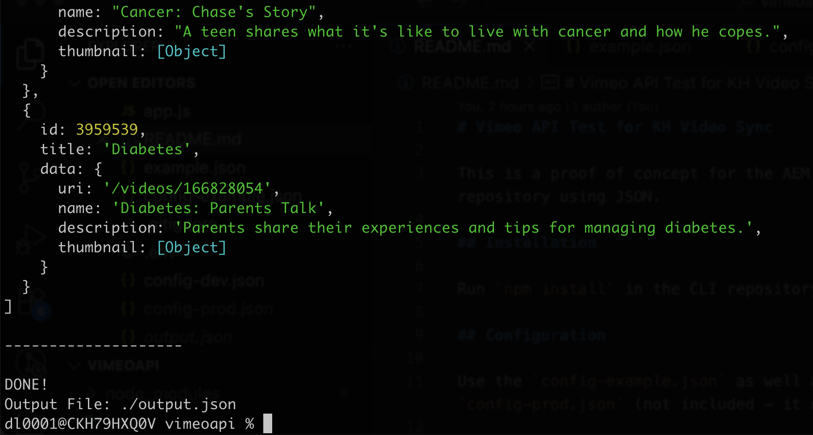

# Vimeo API Test for KH Video Sync

This is a proof of concept for the AEM Cloud Re-platform to sync videos between Vimeo and our repository using JSON.

## Installation

Run `npm install` in the CLI repository root folder.

## Configuration

Use the `config-example.json` as well as the included `config-dev.json` to set up a file name `config-prod.json` (not included – it needs to be created).

By default the script is looking at production and specifically the file `config-prod.json` for Vimeo API access. Alternatively the `.env` file can be updated to point to `NODE_ENV=dev` which will have the script look at `config-dev.json` if the environment is dev.

## Run

Execute `npm run start` and it will run the script which will output to the console as well as write to a file `output.json`.

